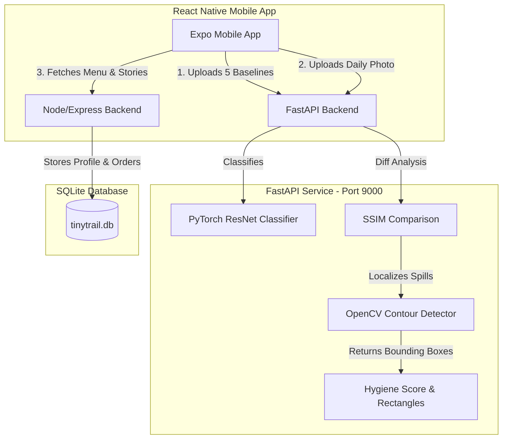

# 🥗 TinyTrail — Hyperlocal AI Hygiene Concierge

An advanced Computer Vision and multi-service platform designed to automate and enforce food hygiene standards for street vendors, home kitchens, and small hotel prep areas in India.

By matching daily workspace photos against a set of 5 clean "onboarding baselines," the system performs real-time anomaly detection, localizes dirty regions, and outputs visual feedback using bounding boxes.

---

## ✨ Key Features

*   **🔍 AI-Powered Hygiene Auditing**: Replaces mock checks with an active PyTorch image classification model optimized for Indian kitchen settings.
*   **🖼️ Anomaly Bounding Box Detection**: Uses SSIM (Structural Similarity Index) and OpenCV contour detection to dynamically find and return exact coordinate rectangles `[x, y, w, h]` for anomalies (spills, clutter, trash).
*   **🤝 Multi-Vendor Baseline Isolation**: Secure storage architecture isolates baseline reference images and metadata per vendor ID.
*   **📱 Expo Mobile Integration**: Complete React Native mobile front-end (under `model/mobile`) configured to capture kitchen photos and render bounding box warnings over dirty workspace zones.
*   **🧬 Safe PyTorch Loading**: Fully compatible with PyTorch 2.6+ unpickling changes (strict loading resolved safely).

---

## 🏗️ Architecture & Component Flow



---

## 🛠️ Tech Stack

*   **AI Backend**: FastAPI, PyTorch, OpenCV, Scikit-Image, Uvicorn
*   **Data Backend**: Node.js, Express, SQLite (Firebase Auth ready)
*   **Mobile App**: React Native, Expo, TypeScript
*   **Web Client**: React.js, TypeScript

---

## 🚀 Quick Start (Local Setup)

For full details, see the beginner-friendly [what_to_do.txt](file:///E:/2026/GIT%20PULL/Projects/TinyTrail/what_to_do.txt).

### 1. Launch FastAPI Hygiene Service
```bash
# Activate virtual environment
Hygine\.venv\Scripts\activate

# Navigate and run app
cd hygiene_service
python app_enhanced.py
```
*Runs on port 9000.*

### 2. Verify AI Health
In another terminal, run the validation script:
```bash
python test_api.py
```
*(Confirms classification and image alignment works correctly).*

### 3. Start DB Server
```bash
cd model/backend-simple
npm install
# Set virtual environment path and run
$env:PYTHON_BIN='../../Hygine/.venv/Scripts/python.exe'
node server-v2.js
```
*Runs on port 8080.*

### 4. Start Expo Mobile Client
```bash
cd model/mobile
npm install
npx expo start
```
*Scan the QR code in Expo Go to test on your mobile device.*

---

## 📂 Project Structure

```
TinyTrail/
├── hygiene_service/       # FastAPI computer vision server
│   └── app_enhanced.py    # Main API service with SSIM & contour box logic
├── Hygine/                # PyTorch model code and training logs
│   ├── models/            # Trained weights (16MB ResNet model)
│   └── workspace_inference.py # Helper functions for Indian kitchen zones
├── model/
│   ├── backend-simple/    # Node.js server and local SQLite database
│   └── mobile/            # React Native Expo app files
├── test_images/           # Sample clean baselines and dirty daily pictures
├── test_api.py            # API automated test suite
├── instructions.txt       # System changes and routing guide
├── what_to_do.txt         # Beginner running guide
└── README.md              # Main project page
```

---

## 📄 License
This project is open-source and free to modify under the [MIT License](LICENSE).
