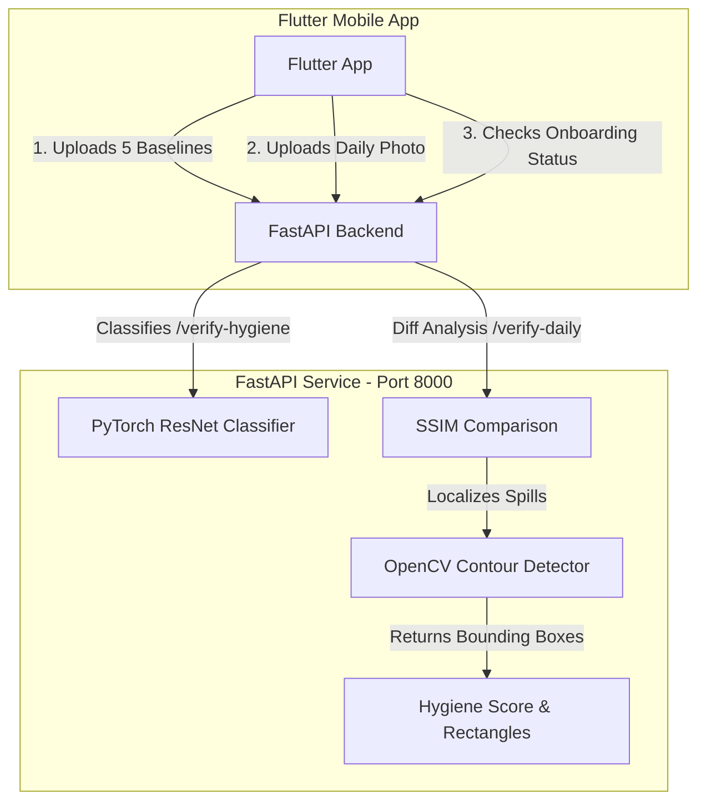

# 🥗 TinyTrail — Hyperlocal AI Hygiene Concierge

An advanced Computer Vision and multi-service platform designed to automate and enforce food hygiene standards for street vendors, home kitchens, and small hotel prep areas in India.

By matching daily workspace photos against a set of 5 clean "onboarding baselines," the system performs real-time anomaly detection, localizes dirty regions, and outputs visual feedback using bounding boxes overlayed directly on the mobile screen.

---

## ✨ Key Features

*   **🔍 AI-Powered Hygiene Auditing**: Replaces mock checks with an active PyTorch image classification model optimized for Indian kitchen settings.
*   **🖼️ Anomaly Bounding Box Detection**: Uses SSIM (Structural Similarity Index) and OpenCV contour detection to dynamically find and return exact coordinate rectangles `[x, y, w, h]` for anomalies (spills, clutter, trash).
*   **🤝 Multi-Vendor Baseline Isolation**: Secure storage architecture isolates baseline reference images and metadata per vendor ID inside the backend.
*   **📱 Flutter Mobile Integration**: Sleek, glassmorphism-designed Flutter application (integrated directly at the root of the project) configured to capture kitchen photos and render red bounding box overlays over dirty workspace zones.
*   **🧬 Safe PyTorch Loading**: Fully compatible with PyTorch 2.6+ unpickling changes (strict loading resolved safely).

---

## 🏗️ Architecture & Component Flow



---

## 🛠️ Tech Stack

*   **AI Backend**: FastAPI, PyTorch, OpenCV, Scikit-Image, Uvicorn
*   **Mobile App**: Flutter, Dart, Firebase (Auth & Profile storage)

---

## 🚀 Quick Start (Local Setup)

For step-by-step setup details, see the [what_to_do.txt](file:///E:/2026/GIT%20PULL/Projects/TinyTrail/what_to_do.txt) guide.

### 1. Launch FastAPI Hygiene Service
```bash
# Activate virtual environment
backend\.venv\Scripts\activate

# Navigate and run app
cd backend
python app_enhanced.py
```
*Runs on port 8000.*

### 2. Verify AI Health
In another terminal, run the validation script:
```bash
cd backend
python test_api.py
```
*(Confirms classification and image alignment works correctly).*

### 3. Launch Flutter Client
```bash
# Run directly from the TinyTrail root
flutter pub get
flutter run
```

---

## 📂 Project Structure

```
TinyTrail/
├── backend/               # FastAPI computer vision server
│   ├── weights/           # Trained models (hygiene_model_indian_kitchen.pth)
│   ├── test_images/       # Sample clean baselines and daily pictures
│   ├── app_enhanced.py    # Main API service with SSIM & contour box logic
│   └── test_api.py        # API automated test suite
├── lib/                   # Flutter Dart source files (screens, widgets, services)
├── android/               # Flutter Android native configuration
├── assets/                # App asset images and resources
├── pubspec.yaml           # Flutter packages specification
├── instructions.txt       # Unified API routing guide
├── what_to_do.txt         # Beginner running guide
└── README.md              # Main project page
```

---

## 📄 License
This project is open-source and free to modify under the [MIT License](LICENSE).
