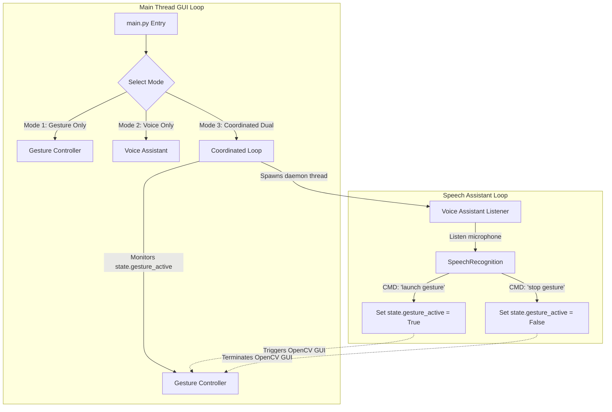

# 🖱️ Coordinated Virtual Mouse & Voice Assistant

A high-performance, robust, and intuitive virtual mouse interface powered by computer vision hand gestures (via **MediaPipe** & **OpenCV**) and an interactive speech control unit (via **SpeechRecognition** & **pyttsx3**).

This system features a **thread-safe coordinated architecture** that coordinates a background listening thread with a main-thread OpenCV GUI loops, ensuring zero crashes. It is designed to act as a sleek, modular mini-project ready for integration into a GitHub repository portfolio.

---

## ✨ Features

*   **⚡ Zero-Latency Cursor Control**: Bypasses PyAutoGUI's default delays for immediate, smooth, and natural mouse tracking.
*   **📐 Active Tracking Region Mapping**: Restricts the hand-tracking area to a customizable center window (e.g., `20%` to `80%` of camera frame) and interpolates it to the full screen, minimizing physical hand movement fatigue.
*   **👐 Hand-Agnostic Gesture Recognition**: Employs a self-calibrating check (comparing index and pinky metacarpal joints) to support both left and right hands seamlessly.
*   **🔒 Click Lock & Drag Safety**:
    *   Click lock prevents repeated clicks when holding fingers in a click pose.
    *   Auto-release fallback releases any active mouse drag if the hand leaves the camera frame or changes pose.
*   **🎤 Background Voice Commands**: Control system actions (right clicks, double clicks, launching apps, typing text) using speech.
*   **🎛️ Configurable Mapping**: Gesture mappings, scroll speeds, smoothing factors, and active tracking coordinates are managed through a unified `config.json`.

---

## 🛠️ System Architecture

The project implements a thread-safe coordination loop that ensures OpenCV's window-handling routines run exclusively on the main thread while voice processing loops in the background.



---

## 🚀 Installation & Setup

### 1. Prerequisites
*   **Python 3.8 to 3.12**
*   Working Webcam
*   Microphone

### 2. Clone and Install Dependencies
Navigate to the project folder and install the required Python packages:

```bash
# Optional: Create and activate a virtual environment
python -m venv .venv
.venv\Scripts\activate

# Install dependencies
pip install -r requirements.txt
```

> [!NOTE]
> On some Windows machines, installing `pyaudio` may require building from source or installing visual studio build tools. The pre-built wheel is automatically retrieved by `pip` on modern Python versions (including 3.12).

---

## ⚙️ Configuration (`config.json`)

Configure thresholds, mapping parameters, and actions without modifying code.

| Parameter | Type | Default Value | Description |
| :--- | :--- | :--- | :--- |
| `gesture_actions` | Object | Mapped poses | Assigns actions (`mouse_down`, `mouse_up`, `click`, `scroll_down`, `scroll_up`) to hand shapes. |
| `scroll_amount` | Integer | `300` | Number of pixels scrolled on scroll gesture. |
| `cursor_smoothing`| Integer | `5` | Exponential Moving Average smoothing divisor. Higher values mean smoother but slower cursor movement. |
| `active_region` | Object | `0.2` to `0.8` | Bounding box limits in normalized camera frame coordinates representing the active tracking window. |
| `voice.enabled` | Boolean | `true` | Enables or disables voice subsystem. |
| `voice.wake_words`| Array | `["proton", "assistant"]`| List of wake words for the voice recognition triggers. |

---

## 🎮 How to Use

Run the main file:
```bash
python main.py
```

Choose one of three modes:
1.  **Gesture Control Only**: Activates the webcam window. Control the mouse and exit by pressing the `ESC` key.
2.  **Voice Assistant Only**: Runs voice speech recognition. Say command items to execute them, and say `exit` to stop.
3.  **Coordinated Dual Mode**: Starts the voice assistant in the background. The webcam window is initialized. You can use gestures and speak commands simultaneously. Say `stop gesture` to close the camera, and `launch gesture` to open it again.

### Gesture Dictionary

*   ✊ **Fist (All fingers folded)**: Left Mouse Button Down (Drag Start).
*   ✋ **Palm (All fingers extended)**: Left Mouse Button Up (Drag End).
*   ☝️ **Index finger extended**: Single Click (triggers only once per pose transition).
*   ✌️ **Index and Middle fingers extended**: Scroll Down.

### Voice Command Dictionary

*   `"launch gesture"`: Starts/opens the camera tracker window.
*   `"stop gesture"` / `"close gesture"`: Suspends/closes the camera tracker window.
*   `"click"`: Performs a mouse left click.
*   `"double click"`: Performs a mouse double click.
*   `"right click"`: Performs a mouse right click.
*   `"type [your message]"`: Types any text starting with the word "type" (e.g. *"type Hello World"*).
*   `"scroll up"` / `"scroll down"`: Scrolls the active page window.
*   `"open youtube"`: Opens YouTube in your default browser.
*   `"open google"`: Opens Google in your default browser.
*   `"what time"`: Speaks the current local system time.
*   `"help"` / `"commands"`: Speaks the list of available voice commands.
*   `"exit"` / `"stop listening"`: Shuts down the assistant and terms execution.

---

## 📂 Project Structure

```
VirtualMouse_Python/
├── gesture/
│   ├── __init__.py      # Package initialization
│   └── controller.py    # MediaPipe hand gesture & PyAutoGUI cursor controller
├── voice/
│   ├── __init__.py      # Package initialization
│   └── assistant.py     # Spech-to-Text & Text-to-Speech logic
├── main.py              # Application entry point & coordination thread management
├── config.json          # Mappings, thresholds, and configuration settings
├── requirements.txt     # Python package requirements
├── .gitignore           # File exclude list
└── README.md            # Documentation
```

---

## 📄 License
This project is open-source and free to modify under the [MIT License](LICENSE).
